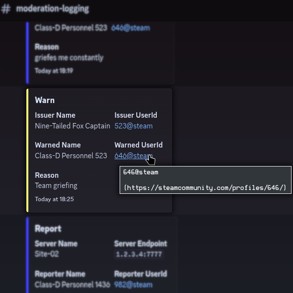

<h1 align="center">SiteGuard 
    
</h1>
SiteGuard is a simple and lightweight moderation plugin for SCP: Secret Laboratory.
No database setup, no Discord bot configuration. Just install it and add your Webhooks to the configuration file.

## Features
- **Warning system:** Issue and track player warnings
- **Moderation logging:** Logs reports, warnings, kicks, and bans
  - If you want to log reports with this plugin, you should not use the "Player reports" feature in the base game config
- **Player tracking:** View a players moderation records with the `SeeRecords` command

## Installation
1. Download the latest .zip file containing the plugin and its dependencies from the [Releases tab](https://github.com/dassenyy/SiteGuard/releases/latest/).
2. Drag it into your Exiled Plugins directory.
    1. On Windows: `C:\Users\%UserName%\AppData\Roaming\EXILED\Plugins`
    2. On Linux: `~/.config/EXILED/Plugins`
3. Unzip it. If asked, allow writing into the `dependencies` directory, don't replace it.
4. Run your server once with the plugin installed to generate the configuration.

## How to set up a Discord Webhook
1. Click "Edit channel" on the channel you want to use
2. Go to "Integrations" -> "Webhooks"
3. Create a new Webhook and click on it
4. Click on Copy Webhook URL and paste it into the config

You can send all actions to the same Webhook, or create a separate channel and Webhook for every action.

## Commands
| Name | Usage | Example | Description |
|------|-------|---------|-------------|
| warn | [PlayerId/Name] [Reason] | warn 7 Team griefing | Warns a player. |
| owarn | [SteamId@steam] [Reason] | owarn 123@steam Team griefing | Warns a player who is offline. |
| seerecords | [PlayerId/Name] [Limit] [Entry Types] | seerecords 7 10 report warn kick ban | Send the last 10 moderation entries of all types for a player to your Discord. |
| oseerecords | [SteamId@steam] [Limit] [Entry Types] | oseerecords 123@steam 5 warn ban | Send the last 5 moderation entries of type warn and ban for a player who is offline to your Discord. |

The PlayerId is the number next to the player in the RemoteAdmin console.

## Licensing
This Plugin's source code is licensed under the GNU Lesser General Public License v3.0.
You can find a copy of the license in the [LICENSE](./LICENSE) file located in the root directory.
 SPDX identifier: `LGPL-3.0-or-later`.

## Thanks!
Thanks for your interest in SiteGuard! 
If you have any issues or feedback, feel free to open a new issue under the [Issues tab](https://github.com/dassenyy/SiteGuard/issues),
or contact me via [pm@dassen.dev](mailto:pm@dassen.dev?subject=Feedback%20/%20Issue%20regarding%20SiteGuard&body=%0D%0A%0D%0AThis%20mail%20is%20related%20to%20the%20following%20project%20on%20GitHub%3A%20%0D%0Ahttps%3A%2F%2Fgithub.com%2Fdassenyy%2FSiteGuard).